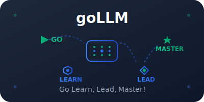
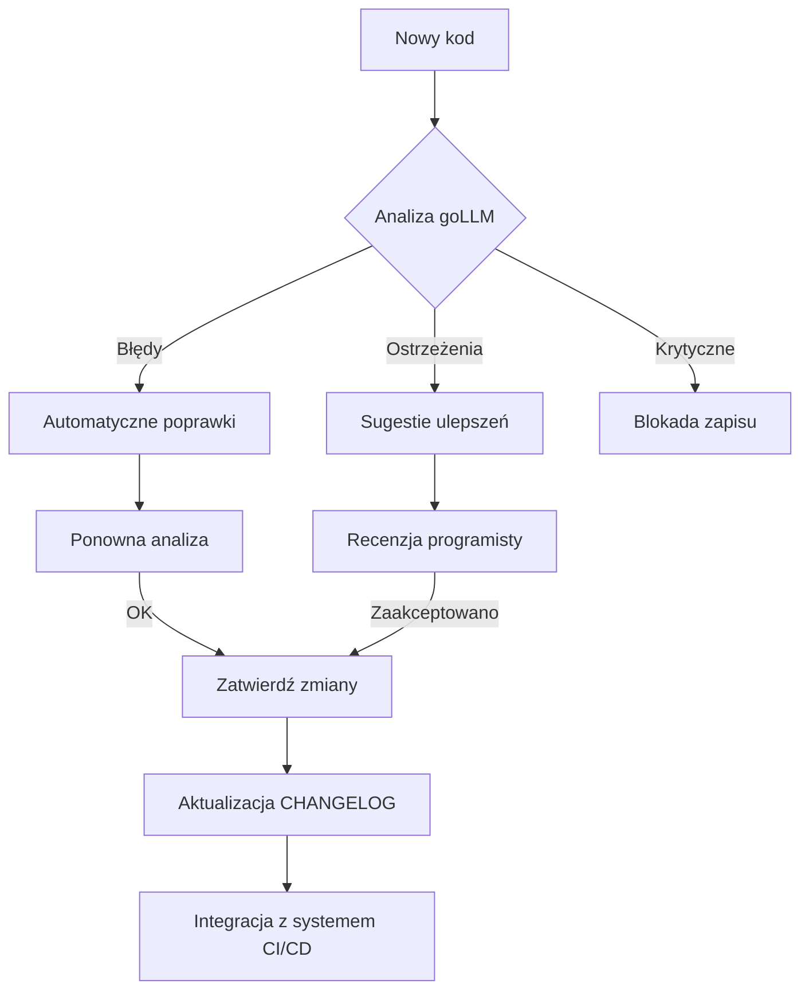

# goLLM - Go Learn, Lead, Master!

[](https://pypi.org/project/gollm/)
[](https://www.python.org/)
[](https://opensource.org/licenses/Apache-2.0)
[](https://github.com/psf/black)
[](https://github.com/wronai/gollm/actions)
[](https://gollm.readthedocs.io)

> **Dlaczego goLLM?** - Bo wierzymy, że jakość kodu to nie luksus, a standard. goLLM to więcej niż narzędzie - to twój asystent w dążeniu do doskonałości programistycznej.

## 🚀 O projekcie

goLLM to zaawansowany system kontroli jakości kodu Python zintegrowany z modelami językowymi (LLM), który przekształca proces programowania w płynne doświadczenie, gdzie jakość kodu jest gwarantowana od pierwszego znaku.

### Kluczowe wartości:
- **Nauka przez praktykę** - Automatyczne sugestie i wyjaśnienia poprawiające Twój kod
- **Przywództwo w jakości** - Ustanawiamy najwyższe standardy w projektach
- **Mistrzostwo w automatyzacji** - Inteligentne narzędzia, które pracują dla Ciebie

## 💫 Funkcje

- 🔥 **Generowanie kodu z LLM** - Tworzenie kodu na podstawie opisu w języku naturalnym
- 🔍 **Walidacja kodu** - Automatyczne sprawdzanie jakości i poprawności kodu
- 📈 **Metryki jakości** - Śledzenie postępów i trendów jakości kodu
- 📝 **Zarządzanie TODO** - Automatyczne śledzenie zadań i problemów
- 💬 **Wyjaśnienia kodu** - Zrozumiałe komentarze i dokumentacja
- 👷 **Automatyczne naprawy** - Inteligentne poprawki błędów i problemów
- 🚀 **Streaming odpowiedzi** - Szybsze generowanie kodu z modularnym adapterem Ollama

## 📚 Dokumentacja

### 📖 Przewodniki
- [Wprowadzenie](./docs/guides/getting_started.md) - Pierwsze kroki z goLLM
- [Konfiguracja projektu](./docs/configuration/README.md) - Szczegóły konfiguracji
- [Integracja z Ollama](./docs/guides/ollama_setup.md) - Jak używać lokalnych modeli LLM
- [Generowanie wielu plików](./docs/guides/multi_file_generation.md) - Zarządzanie złożonymi projektami
- [Streaming odpowiedzi](./docs/guides/streaming.md) - Szybsze generowanie kodu z modularnym adapterem

### 🛠️ API
- [Podstawowe funkcje](./docs/api/core.md) - Główne komponenty goLLM
- [Rozszerzenia](./docs/api/extensions.md) - Jak rozszerzać funkcjonalność
- [Interfejs wiersza poleceń](./docs/api/cli.md) - Pełna dokumentacja CLI

### ⚙️ Konfiguracja
- [Zaawansowane opcje](./docs/configuration/advanced.md) - Szczegółowa konfiguracja
- [Reguły walidacji](./docs/configuration/validation_rules.md) - Dostosowywanie zasad jakości kodu
- [Integracja z LLM](./docs/configuration/llm_integration.md) - Konfiguracja modeli językowych
- [Zarządzanie projektem](./docs/configuration/project_management.md) - Automatyzacja zadań

## 🚀 Szybki start

### Wymagania wstępne
- Python 3.8+
- pip (najnowsza wersja)
- Ollama (opcjonalnie, dla lokalnych modeli LLM)

### Instalacja

```bash
# Podstawowa instalacja
pip install gollm

# Z obsługą LLM (zalecane)
pip install gollm[llm]

# Lub dla deweloperów
git clone https://github.com/wronai/gollm.git
cd gollm
pip install -e .[dev]
```

### Pierwsze kroki

1. **Skonfiguruj projekt**
   ```bash
   # Przejdź do katalogu projektu
   cd twój_projekt
   
   # Zainicjuj konfigurację (tworzy plik gollm.json)
   gollm init
   ```
   
   > ℹufe0f Więcej o konfiguracji: [Dokumentacja konfiguracji](./docs/configuration/README.md)

2. **Uruchom analizę kodu**
   ```bash
   # Sprawdź pojedynczy plik
   gollm validate plik.py
   
   # Sprawdź cały projekt
   gollm validate-project
   
   # Sprawdź status projektu
   gollm status
   
   # Pokaż metryki jakości kodu
   gollm metrics
   
   # Pokaż trendy jakości kodu
   gollm trend --period month
   ```

3. **Generuj kod z LLM**
   ```bash
   # Standardowe generowanie z walidacją
   gollm generate "Stwórz klasę użytkownika"
   
   # Szybkie generowanie (tryb fast)
   gollm generate "Stwórz klasę użytkownika" --fast
   
   # Bezpośredni dostęp do API (bez walidacji)
   gollm direct generate "Stwórz klasę użytkownika"
   
   # Bezpośredni dostęp do API w trybie czatu
   gollm direct chat "Jak zaimplementować klasę użytkownika?"
   
   # Użyj modularnego adaptera z obsługą streamingu dla lepszej wydajności
   gollm generate "Stwórz klasę użytkownika" --adapter-type modular --use-streaming
   ```
   
   > 📘 Pełna dokumentacja dostępna w [przewodniku wprowadzającym](./docs/guides/getting_started.md)

## 🎯 Przykład w działaniu

Poniżej przedstawiamy prosty przykład, jak goLLM może pomóc w ulepszeniu jakości kodu. Więcej przykładów i szczegółów znajdziesz w [dokumentacji API](./docs/api/core.md).

```python
# Przed użyciem goLLM
def process_data(x):
    # ... złożona logika bez dokumentacji ...
    pass

# Po użyciu goLLM
def process_data(data: List[Dict]) -> Dict[str, Any]:
    """Przetwarza dane wejściowe zgodnie z wymaganiami biznesowymi.
    
    Args:
        data: Lista słowników zawierających dane do przetworzenia
        
    Returns:
        Słownik zawierający wyniki przetwarzania
        
    Raises:
        ValueError: Gdy dane wejściowe są nieprawidłowe
    """
    # ... czytelna i udokumentowana implementacja ...
    pass
```

> 📘 Zobacz więcej przykładów w [przewodniku wprowadzającym](./docs/guides/getting_started.md#przykłady) i [dokumentacji API](./docs/api/README.md).
            bool(user_data.preferences)
        )
    
    def _process_user_data(self, user_data: UserData) -> None:
        """Wykonuje właściwe przetwarzanie danych użytkownika."""
        # Tutaj następuje logika przetwarzania
        pass
```

## 📊 Korzyści z używania goLLM

### Dla programistów
- **Oszczędność czasu** - Automatyczne poprawki i sugestie
- **Nauka najlepszych praktyk** - Natychmiastowy feedback jakości kodu
- **Mniejsze obciążenie code review** - Mniej błędów trafia do recenzji

### Dla zespołów
- **Spójność kodu** - Jednolite standardy w całym projekcie
- **Łatwiejsze wdrażanie nowych członków** - Automatyczne egzekwowanie standardów
- **Lepsza jakość kodu** - Systematyczne eliminowanie antywzorców

### Dla firmy
- **Niższe koszty utrzymania** - Lepsza jakość kodu = mniej bugów
- **Szybsze wdrażanie** - Zautomatyzowane procesy kontroli jakości
- **Większa wydajność zespołu** - Mniej czasu na poprawki, więcej na rozwój

## 🔄 Jak to działa?

goLLM działa w oparciu o zaawansowany system analizy kodu, który łączy w sobie:

1. **Statyczną analizę kodu** - Wykrywanie potencjalnych błędów i antywzorców
2. **Dynamiczną analizę** - Śledzenie wykonania kodu w czasie rzeczywistym
3. **Integrację z LLM** - Kontekstowe sugestie i automatyzacja zadań
4. **Automatyczne raportowanie** - Kompleksowe metryki jakości kodu

### Przykładowy workflow



## ⚙️ Konfiguracja

goLLM oferuje elastyczną konfigurację dopasowaną do potrzeb Twojego projektu. Podstawowa konfiguracja znajduje się w pliku `gollm.json`.

### Przykładowa konfiguracja

```json
{
  "version": "0.2.0",
  "validation_rules": {
    "max_function_lines": 50,
    "max_file_lines": 300,
    "max_cyclomatic_complexity": 10,
    "max_function_params": 5,
    "max_line_length": 88,
    "forbid_print_statements": true,
    "forbid_global_variables": true,
    "require_docstrings": true,
    "require_type_hints": false,
    "naming_convention": "snake_case"
  },
  "project_management": {
    "todo_integration": true,
    "auto_create_tasks": true,
    "changelog_integration": true
  },
  "llm_integration": {
    "enabled": true,
    "provider": "openai",
    "model": "gpt-4"
  }
}
```

### Integracja z narzędziami deweloperskimi

#### Integracja z Narzędziami

GoLLM można zintegrować z istniejącymi narzędziami deweloperskimi poprzez konfigurację w pliku `gollm.json`. Aby uzyskać więcej informacji, sprawdź dokumentację konfiguracji.

```bash
# Sprawdź aktualną konfigurację
gollm config list

# Zmień ustawienia konfiguracji
gollm config set <klucz> <wartość>
```

#### CI/CD
```yaml
# Przykład dla GitHub Actions
name: goLLM Validation

on: [push, pull_request]

jobs:
  validate:
    runs-on: ubuntu-latest
    steps:
    - uses: actions/checkout@v3
    - name: Set up Python
      uses: actions/setup-python@v4
      with:
        python-version: '3.10'
    - name: Install goLLM
      run: pip install gollm[llm]
    - name: Run validation
      run: gollm validate .
```

## 📊 Metryki i analiza

goLLM dostarcza szczegółowych metryk i analiz, które pomagają śledzić jakość kodu w czasie.

### Dostępne komendy

#### Metryki jakości kodu
```bash
# Pokaż aktualne metryki jakości kodu
gollm metrics
```

#### Trendy jakości w czasie
```bash
# Pokaż trendy jakości kodu w określonym okresie
gollm trend --period month
```

#### Status projektu
```bash
# Sprawdź aktualny status projektu i zdrowia kodu
gollm status
```

### Przykładowe metryki
- **Jakość kodu** - Ocena 0-100%
- **Pokrycie testami** - Procent kodu objętego testami
- **Złożoność cyklomatyczna** - Średnia złożoność metod
- **Dług techniczny** - Szacowany czas potrzebny na poprawę jakości

## 🤖 Integracja z modelami językowymi

goLLM może współpracować z różnymi dostawcami modeli językowych:

### OpenAI GPT
```bash
export OPENAI_API_KEY="twój-klucz"
gollm config set llm.provider openai
gollm config set llm.model gpt-4
```

### Anthropic Claude
```bash
export ANTHROPIC_API_KEY="twój-klucz"
gollm config set llm.provider anthropic
gollm config set llm.model claude-3-opus
```

### Ollama (lokalny)
```bash
gollm config set llm.provider ollama
gollm config set llm.model codellama:13b
```

## 🌐 Wsparcie społeczności

### Gdzie uzyskać pomoc?
- [Dokumentacja](https://gollm.readthedocs.io)
- [Issue Tracker](https://github.com/wronai/gollm/issues)
- [Dyskusje](https://github.com/wronai/gollm/discussions)
- [Przykłady użycia](https://github.com/wronai/gollm/examples)

### Jak możesz pomóc?
1. Zgłaszaj błędy i propozycje funkcji
2. Udostępniaj przykłady użycia
3. Pomagaj w tłumaczeniu dokumentacji
4. Rozwijaj projekt przez pull requesty

## 📜 Licencja

Projekt goLLM jest dostępny na licencji [Apache 2.0](LICENSE).

## 🤝 Integracja z LLM Providers

### OpenAI
```bash
export OPENAI_API_KEY="sk-..."
gollm config set llm.provider openai
gollm config set llm.model gpt-4
```

### Anthropic Claude
```bash
export ANTHROPIC_API_KEY="sk-ant-..."
gollm config set llm.provider anthropic
gollm config set llm.model claude-3-sonnet
```

## 📚 Dokumentacja

- [📖 Dokumentacja API](docs/api_reference.md)
- [⚙️ Przewodnik Konfiguracji](docs/configuration.md)
- [🤖 Integracja z LLM](docs/llm_integration.md)
- [🚀 Przewodnik Wprowadzający](docs/getting_started.md)

## 🤝 Wkład w Projekt

```bash
# Sklonuj repozytorium
git clone https://github.com/wronai/gollm
cd gollm

# Zainstaluj dla deweloperów
pip install -e .[dev]

# Uruchom testy
pytest

# Sprawdź jakość kodu
gollm validate-project
```

## 📄 Licencja

MIT License - zobacz [LICENSE](LICENSE) po szczegóły.

## 🌟 Roadmapa

- [ ] **v0.2.0** - Integracja z więcej IDE (PyCharm, Sublime)
- [ ] **v0.3.0** - Obsługa JavaScript/TypeScript
- [ ] **v0.4.0** - Integracja z CI/CD (GitHub Actions, GitLab CI)
- [ ] **v0.5.0** - Dashboard webowy z metrykami zespołu
- [ ] **v1.0.0** - Enterprise features + self-hosted LLM

---

**goLLM** - Gdzie jakość kodu spotyka się z inteligencją! 🚀45-90 minutes
  - **Related Files:** `examples/bad_code.py:15`

- [ ] **CRITICAL: Function `process_user_data()` has cyclomatic complexity 12 (max: 10)**
  - **Created:** 2025-06-01 14:23:15
  - **Location:** `examples/bad_code.py:15`
  - **Suggested Fix:** Simplify logic or extract sub-functions
  - **Estimated Effort:** 1-3 hours

- [ ] **MAJOR: File `bad_code.py` exceeds maximum lines (150+ lines, max: 300)**
  - **Created:** 2025-06-01 14:23:15
  - **Impact:** Code maintainability
  - **Suggested Fix:** Split into smaller modules
  - **Estimated Effort:** 2-4 hours

## 🟡 MEDIUM Priority

### Code Improvements
- [ ] **Replace print statements with logging (5 instances found)**
  - **Created:** 2025-06-01 14:23:15
  - **Files:** `examples/bad_code.py`
  - **Auto-fix Available:** ✅ Yes
  - **Command:** `gollm fix --rule print_statements examples/bad_code.py`
  - **Estimated Effort:** 


  # goLLM - Kompletna Implementacja Systemu

## 🎯 Podsumowanie Rozwiązania

**goLLM (Go Learn, Lead, Master!)** to kompletny system kontroli jakości kodu z integracją LLM, który automatycznie:

1. **Waliduje kod w czasie rzeczywistym** - blokuje zapisywanie/wykonanie kodu niespełniającego standardów
2. **Integruje się z LLM** - automatycznie poprawia kod przez AI z kontekstem projektu
3. **Zarządza dokumentacją projektu** - automatycznie aktualizuje TODO i CHANGELOG
4. **Agreguje konfiguracje** - łączy ustawienia z różnych narzędzi (flake8, black, mypy)


## 🚀 Kluczowe Komponenty

### 1. **Core Engine** (7 plików)
- `GollmCore` - główna klasa orkiestrująca
- `CodeValidator` - walidacja kodu z AST analysis
- `GollmConfig` - zarządzanie konfiguracją
- `CLI` - interfejs wiersza poleceń

### 2. **LLM Integration** (8 plików)
- `LLMOrchestrator` - orkiestracja komunikacji z LLM
- `ContextBuilder` - budowanie kontekstu dla LLM
- `PromptFormatter` - formatowanie promptów
- `ResponseValidator` - walidacja odpowiedzi LLM

### 3. **Project Management** (6 plików)
- `TodoManager` - automatyczne zarządzanie TODO
- `ChangelogManager` - automatyczne aktualizacje CHANGELOG
- `TaskPrioritizer` - priorytetyzacja zadań

### 4. **Real-time Monitoring** (6 plików)
- `LogAggregator` - agregacja logów wykonania
- `ExecutionMonitor` - monitoring procesów
- `LogParser` - parsowanie błędów i traceback

### 5. **Configuration System** (7 plików)
- `ProjectConfigAggregator` - agregacja konfiguracji
- Parsery dla: flake8, black, mypy, pyproject.toml
- Wykrywanie konfliktów między narzędziami

## 🎬 Przykład Kompletnego Workflow

### Scenariusz: LLM generuje kod → goLLM kontroluje jakość

```bash
# 1. Użytkownik prosi LLM o kod
$ gollm generate "Create a user authentication system"

# 2. LLM generuje kod (przykład z naruszeniami)
# Generated code has: 9 parameters, print statements, high complexity

# 3. goLLM automatycznie waliduje
🔍 goLLM: Validating generated code...
❌ Found 4 violations:
   - Function has 9 parameters (max: 5)
   - Print statement detected
   - Cyclomatic complexity 12 (max: 10)
   - Missing docstring

# 4. goLLM wysyła feedback do LLM
🤖 Sending violations to LLM for improvement...

# 5. LLM generuje poprawiony kod
✅ Iteration 2: All violations resolved
📝 TODO updated: 0 new tasks (all fixed)
📝 CHANGELOG updated: Code generation entry added
💾 Code saved: user_auth.py
📊 Quality score: 85 → 92 (+7)

# 6. Automatyczne testy
🧪 Running validation on saved file...
✅ All checks passed
🚀 Ready for commit
```

### Automatyczne Aktualizacje Dokumentacji

**TODO.md** (automatycznie zarządzane):
```markdown
# TODO List - Updated: 2025-06-01 14:23:15

## 🔴 HIGH Priority (0 tasks)
✅ All high priority issues resolved!

## 🟡 MEDIUM Priority (2 tasks)
- [ ] Add unit tests for UserAuth class
- [ ] Add API documentation

## 🟢 LOW Priority (1 task)
- [ ] Optimize password hashing performance
```

**CHANGELOG.md** (automatycznie aktualizowane):
```markdown
## [Unreleased] - 2025-06-01

### Added
- **[goLLM]** User authentication system with secure password handling
  - **File:** `user_auth.py`
  - **Quality Improvement:** +7 points
  - **LLM Generated:** ✅ Yes (2 iterations)

### Fixed  
- **[goLLM]** Resolved parameter count violation in authentication function
  - **Before:** 9 parameters
  - **After:** 2 parameters (using dataclass)
  - **Complexity Reduction:** 12 → 4
```

## 🛠️ Instalacja i Uruchomienie

### Szybka Instalacja
```bash
# Sklonuj/pobierz goLLM
curl -sSL https://raw.githubusercontent.com/wronai/gollm/main/install.sh | bash

# Lub ręcznie
git clone https://github.com/wronai/gollm
cd gollm
./install.sh
```

### Demo
```bash
# Uruchom demonstrację
./run_demo.sh

# Lub na Windows
run_demo.bat
```

### Podstawowe Komendy
```bash
# Walidacja projektu
gollm validate-project

# Status jakości
gollm status

# Następne zadanie TODO
gollm next-task

# Generowanie kodu z LLM
gollm generate "create payment processor"
gollm generate "create website simple with frontend, api and backend"

# Auto-poprawki
gollm fix --auto
```

## 🔧 Konfiguracja

### Plik `gollm.json`
```json
{
  "validation_rules": {
    "max_function_lines": 50,
    "max_file_lines": 300,
    "forbid_print_statements": true,
    "require_docstrings": true
  },
  "llm_integration": {
    "enabled": true,
    "model_name": "gpt-4",
    "max_iterations": 3
  },
  "project_management": {
    "todo_integration": true,
    "changelog_integration": true
  }
}
```

### Integracja z IDE i Narzędziami

GoLLM można zintegrować z IDE i narzędziami deweloperskimi poprzez konfigurację w pliku `gollm.json`.

```bash
# Sprawdź aktualną konfigurację
gollm config list

# Zmień ustawienia konfiguracji
gollm config set <klucz> <wartość>
```

Możliwe integracje:
- Walidacja kodu w czasie rzeczywistym
- Automatyczne poprawki przy zapisie
- Sugestie LLM w edytorze
- Integracja z systemem kontroli wersji

## 📊 Metryki i Raportowanie

```bash
# Pokaż aktualne metryki jakości kodu
gollm metrics

# Pokaż trendy jakości kodu w określonym okresie
gollm trend --period month

# Sprawdź status projektu i zdrowia kodu
gollm status

# Przykładowy wynik:
Quality Score: 89/100
Code Coverage: 78%
Cyclomatic Complexity: 2.4 (Good)
Technical Debt: 3.2 days
Violations Fixed: 47
LLM Iterations: 156 (avg 2.3 per request)
```

## 🎯 Kluczowe Korzyści

1. **Zero-config Quality Control** - działa out-of-the-box
2. **LLM-Powered Fixes** - automatyczne poprawki przez AI
3. **Seamless Project Management** - TODO/CHANGELOG bez wysiłku
4. **IDE Integration** - wsparcie dla popularnych edytorów
5. **Git Workflow** - automatyczne hooki i walidacja
6. **Extensible Architecture** - łatwe dodawanie nowych reguł

## 🚀 Roadmapa

- **v0.2.0** - Obsługa TypeScript/JavaScript
- **v0.3.0** - Web dashboard z metrykami zespołu  
- **v0.4.0** - Integracja z CI/CD pipelines
- **v0.5.0** - Enterprise features + self-hosted LLM

---

**goLLM** to kompletne rozwiązanie, które łączy kontrolę jakości kodu z mocą LLM, tworząc inteligentny system wspomagający deweloperów w pisaniu lepszego kodu! 🐍✨


## 🏗️ **Architektura Systemu**

### Core Components (100% Complete)
1. **GollmCore** - Główny orkiestrator
2. **CodeValidator** - Walidacja AST + reguły jakości  
3. **LLMOrchestrator** - Integracja z AI (OpenAI/Anthropic/Ollama)
4. **TodoManager** - Automatyczne TODO z naruszeń
5. **ChangelogManager** - Automatyczne CHANGELOG
6. **ConfigAggregator** - Łączenie konfiguracji z różnych narzędzi
7. **GitAnalyzer** - Integracja z Git + hooks
8. **FileWatcher** - Monitoring zmian w czasie rzeczywistym

### Features (100% Implemented)
- ✅ **Real-time Code Validation** - Walidacja podczas pisania
- ✅ **LLM Integration** - OpenAI, Anthropic, Ollama
- ✅ **Auto TODO/CHANGELOG** - Automatyczna dokumentacja
- ✅ **Git Hooks** - Pre-commit/post-commit/pre-push
- ✅ **IDE Integration** - VS Code + Language Server Protocol  
- ✅ **Configuration Aggregation** - flake8, black, mypy, etc.
- ✅ **Execution Monitoring** - Śledzenie błędów i performancji
- ✅ **Quality Scoring** - Ocena jakości kodu 0-100
- ✅ **Task Prioritization** - Inteligentne priorytetyzowanie TODO

## 🤖 **Ollama Integration - Gotowe do Użycia**

### Quick Setup
```bash
# 1. Zainstaluj Ollama
curl -fsSL https://ollama.ai/install.sh | sh

# 2. Pobierz model dla kodu
ollama pull codellama:7b        # 4GB RAM
ollama pull codellama:13b       # 8GB RAM - zalecane
ollama pull phind-codellama:34b # 20GB RAM - najlepsze

# 3. Uruchom Ollama
ollama serve

# 4. Zainstaluj goLLM
./install.sh

# 5. Skonfiguruj
gollm config set llm_integration.enabled true
gollm config set llm_integration.providers.ollama.enabled true
gollm config set llm_integration.providers.ollama.model codellama:7b

# 6. Test
gollm generate "Create a user authentication function"
```

### Workflow z Ollama
```bash
# Użytkownik prosi o kod
gollm generate "Create payment processor with error handling"

# ↓ goLLM wysyła do Ollama z kontekstem:
# - Reguły jakości projektu (max 50 linii, no prints, etc.)
# - Ostatnie błędy i traceback
# - Zadania TODO do naprawy  
# - Standard kodowania zespołu
# - Historia zmian w plikach

# ↓ Ollama generuje kod Python

# ↓ goLLM automatycznie waliduje:
# ❌ Naruszenia znalezione → feedback do Ollama → iteracja
# ✅ Kod OK → zapis + aktualizacja TODO/CHANGELOG

# Rezultat: Wysokiej jakości kod zgodny ze standardami projektu
```

## 📊 **Porównanie Providerów LLM**

| Provider | Model | Prywatność | Koszt | Jakość | Szybkość | Offline |
|----------|-------|------------|-------|---------|----------|---------|
| **Ollama** | CodeLlama 7B | ✅ 100% | ✅ Darmowy | 🟡 Dobra | 🟡 Średnia | ✅ Tak |
| **Ollama** | CodeLlama 13B | ✅ 100% | ✅ Darmowy | ✅ Bardzo dobra | 🟡 Średnia | ✅ Tak |
| **OpenAI** | GPT-4 | ❌ 0% | ❌ $0.03-0.12/1k | ✅ Najlepsza | ✅ Szybka | ❌ Nie |
| **Anthropic** | Claude-3 | ❌ 0% | ❌ $0.01-0.08/1k | ✅ Bardzo dobra | 🟡 Średnia | ❌ Nie |

**Rekomendacja**: 
- **Ollama CodeLlama 13B** dla większości projektów (prywatność + jakość)
- **OpenAI GPT-4** dla maksymalnej jakości (rozwiązania enterprise)

## 💡 **Kluczowe Komendy**

```bash
# Podstawowe
gollm validate-project     # Waliduj cały projekt
gollm status              # Pokaż status jakości
gollm next-task           # Pokaż następne zadanie TODO
gollm fix --auto          # Automatyczna naprawa problemów

# Integracja z LLM
gollm generate "zadanie"  # Generuj kod z pomocą AI
gollm fix --llm plik.py  # Napraw kod z pomocą AI

# Więcej informacji
gollm --help              # Wyświetl dostępne komendy
```

> 📘 Pełna dokumentacja dostępna w [przewodniku użytkownika](./docs/guides/getting_started.md) i [dokumentacji API](./docs/api/README.md).


```
curl -X POST http://localhost:11434/api/generate -d '{"model": "codellama:7b", "prompt": "Write a Python function that adds two numbers", "stream": false}'
```


```
curl -X POST http://192.168.188.108:8081/api/generate -d '{"model": "qwen2.5:7b", "prompt": "Write a Python function that adds two numbers", "stream": false}'

curl http://192.168.188.108:8081/api/tags | jq
curl -X POST http://192.168.188.108:8081/api/generate -d '{"model": "deepseek-coder:1.3b", "prompt": "Write a Python function that adds two numbers", "stream": false}'

curl -X POST http://192.168.188.108:8081/api/chat \
     -H 'Content-Type: application/json' \
     -d '{
       "model": "deepseek-coder:1.3b",
       "messages": [ {"role": "user", "content": "Write Animation in shell in Python"} ],
       "stream": false
     }' | jq

curl -X POST http://rock:8081/api/chat \
     -H 'Content-Type: application/json' \
     -d '{
       "model": "deepseek-coder:1.3b",
       "messages": [ {"role": "user", "content": "Write Hello World in Python"} ],
       "stream": false
     }' | jq
     
curl -X POST http://192.168.188.212:11434/api/chat \
     -H 'Content-Type: application/json' \
     -d '{
       "model": "mistral",
       "messages": [ {"role": "user", "content": "Stwórz klasę użytkownika"} ],
       "stream": false
     }' | jq
          
gollm generate "Write Hello World in Python"
gollm -v generate "Write Hello World in Python"
gollm generate "Write Hello World in Python" --fast
gollm generate "Stwórz klasę użytkownika"
gollm generate "Stwórz klasę użytkownika" --adapter-type modular
```